# BI Labor - Hadoop

## Emlékeztető

### Apache NiFi - [NiFi](https://nifi.apache.org)

Az Apache NiFi egy az Apache Software Foundation által karbantartott szoftver, mely segítségével adatfolyamokat menedzselhetünk és automatizálhatunk.
A projekt igen népszerű, többek között azon oknál fogva, hogy számos adatforrással és célponttal tud dolgozni, valamint kiterjedt lehetőségeket biztosít az adatok feldolgozására is.
Felhasználási területei igen széleskörűek, mi egyfajta ETL eszközként fogunk rá tekinteni, amely segít az adatok különböző forrásokból történő betöltésében, előfeldolgozásában.

#### Fontos fogalmak

1. *FlowFile:* Egy FlowFile lényegében egy csomagként fogható fel, amely a rendszerben halad az egyes adatfolyamok mentén. Minden FlowFile két elemből áll össze, a metaadatokat tartalmazó attribútumokból, és a FlowFilehoz tartozó adat tartalmából.
2. *FlowFile Processor:* A lényegi munkát a Processorok végzik el. Feladatuk lehet az adat transzformálása, routeolása, vagy betöltése valamilyen külső rendszerbe. A Processorok hozzáférnek a FlowFileok attribútumaihoz, és tartalmához is. A NiFi adatfolyam gráfjaiban ezek a csomópontok.
3. *Connection:* Az egyes Processorokat valamilyen módon össze kell kötni, ebben segítenek a Connectionök. Annak érdekében, hogy a különböző sebességgel működő Processorok összeköthetők legyenek, a köztük lévő kapcsolatok egyfajta várakozási sorként is működnek, melyek paraméterei konfigurálhatók.
4. *Flow Controller:* Ütemezőként működik, amely az egyes Processorok számára fenntartott szálakat és erőforrásokat kezeli.
5. *Process Group:* Feldolgozási egység, amely tartalmazhat Processorokat és Connectionöket. Fogadhat, illetve küldhet adatot az Input és Output portjain keresztül. Tipikusan a különböző absztrakciós szinten mozgó feldolgozási elemek egységbe foglalására használjuk.

### Superset - [Superset](https://superset.incubator.apache.org/)

A Superset egy web alapú dashboard készítő eszköz, ami SQL adatforrásokat tud használni. Segítségével grafikus módon, akár jelentősebb SQL tudás nélkül is látványos kimutatásokat készíthetünk. Fejlesztését az Airbnb nél kezdték. Főbb entitások a rendszerben:

* Dashboard - Sliceokból álló felület, Sliceok (grafikonok) csoportosítása
* Chart - Alap egység, grafikon
* Table - Adatbázis tábla
* Database - Adatbázis

Az alkalmazásban a forrás adatbázis és annak táblái felvételét követően chartokat definiálunk. A chartokat dashboardokhoz rendelve különbőző felületeket készíthetünk. Az eszköz remekül használható olyan dashboardok keszítésére melyet nem IT-s ügyfeleknek szolgaltatnak adatokat. Az elkészített felületek könnyen egyedi weboldalakba is ágyazhatók.

### Zeppelin - [Zeppelin](https://zeppelin.apache.org/)

Az Apache Zeppelin egy web alapú notebook eszköz. Könnyen bővíthető architektúrájának köszönhetően számos interpreter érhető el hozzá melyekkel SQL lekérdezéseket, Python vagy éppen Spark kódrészleteket futtathatunk. Az eszköz kiválóan alkalmas data exploration feladatokra, kísérletezésre.

## Vezetett rész

### 0. Feladat - környezet előkészítése

A labor során az összes szükséges eszköt Docker konténerként fogjuk futtatni Docker Compose segítségével, így ezeknek elérhetőnek kell lenniük a környezetünkben. 

A Docker egy konténer alapú, kis overheadű virtualizációs technológia. Segítségével Dockler Imagekből Docker Container eket tudunk indítani, mely egy egy szolgáltatás, szoftvert tartalmaznak. Néhány alapvető paranccsal termnálból menedzselhetjük ezeket.

* ```docker ps``` - futó konténerek listázása
* ```docker exec -it <konténer név> bash``` - terminált nyit az adott konténerbe. [További hasznos parancsok.](https://devhints.io/docker)

A következő konténerekre lesz szükség a labor során:

* MySQL
* NiFi
* Superset
* Zeppelin

A következő parancsokkal indíthatjuk el őket:

**Otthon:**

Otthoni környezetben a docker-compose.yml használandó.

```sh
docker-compose -p bilabor up -d

docker exec -it bilabor_superset_1 superset-init
```

A második parancs során fog a Superset inicializálódni, többek közt itt adható meg az admin felhasználó neve és jelszava, amivel később a felületen be tudunk lépni.

**Egyetemi Labor környezetben:**

Docker beállitásokban felvenni a tanszéki privát Docker Registryt. A egyetemi környezethez szükséges leíró a docker-compose-aut.yml.

```sh
docker-compose -p bilabor -f docker-compose-aut.yml up -d

docker exec -it bilabor_superset_1 superset-init
```

A második parancs során fog a Superset inicializálódni, többek közt itt adható meg az admin felhasználó neve és jelszava, amivel később a felületen be tudunk lépni.

### 1. Feladat - adatbetöltés Apache NiFivel

[NiFi UI](http://localhost:16002/nifi/)

A repository `data` mappájában megtalálhatunk három adathalmazt, amelyet a [http://movielens.org](http://movielens.org) oldalon található filmadatbázisból, és a hozzá tartozó értékelésekből nyertek ki.
A labor során ezekkel az adathalmazokkal fogunk dolgozni.

Az adatfileokat le kell töltenünk a NiFi konténerébe, ehhez tegyük a következőt:

```sh
docker exec -it bilabor_nifi_1 bash

cd ..

mkdir movies
mkdir ratings
mkdir users

cd movies

wget https://raw.githubusercontent.com/bi-labor/Hadoop/master/data/movies.dat

cd ..
cd ratings

wget https://raw.githubusercontent.com/bi-labor/Hadoop/master/data/ratings.dat

cd ..
cd users

wget https://raw.githubusercontent.com/bi-labor/Hadoop/master/data/users.dat

```

MySQL driver letöltése

```sh
cd ..

mkdir mysql
cd mysql

wget https://repo1.maven.org/maven2/mysql/mysql-connector-java/5.1.48/mysql-connector-java-5.1.48.jar

exit
```

#### 1.1 Feladat - Movies dataset betöltése

Az első betöltendő adathalmaz néhány népszerű film adatait tartalmazza.
Apache NiFi használatával töltsük be a fájl tartalmát MySQL-be, a `movies` táblába. (szeparator karakter: ::)

Első lépésként létre kell hoznunk a megfelelő adatbázistáblákat:

```sh
docker exec -it bilabor_db_1 bash

mysql -uroot -proot

use hadooplabor;
```

```sql
CREATE TABLE movies (
    id int,
    title varchar(255),
    genres varchar(255),
    PRIMARY KEY(id)
);
```

Az adatbetöltéshez egy egyszerű workflowt fogunk létrehozni NiFi-ben. Az adatok beolvasásárért a `GetFile`, míg az SQL-be írásért a `PutSQL` processzor a felelős. Ezeket a nifi felületén a felső eszköztár balodlali 'Processors' ikonját a canvas-re húzva adhatjuk hozzá. A felugró ablak felsorolja az osszes elérhető processzor típust, ezekből kell a megfelelőt kikeresnünk.
Konfiguráljuk be ezeket úgy, hogy a `GetFile` a `/opt/nifi/movies` mappát figyelje. A beállítások eléréséhez kattintsunk kétszer egy processzoron, vagy jobbklikk -> configure.

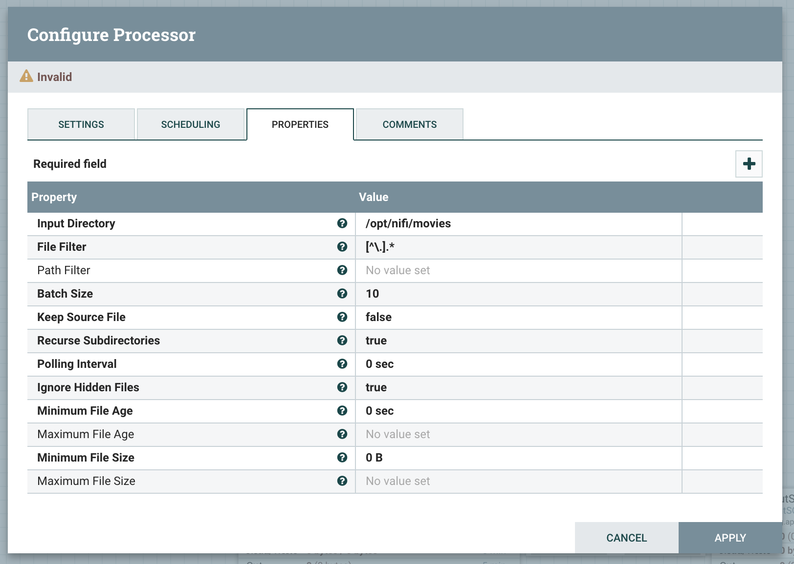

A fájl felolvasását követően bontsuk azt sorokra a `SplitText` processzorral.

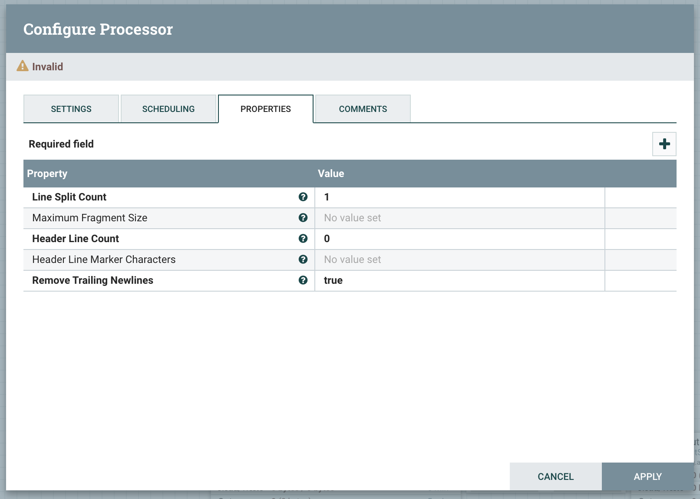

Az egyes sorokat SQL INSERT statementekké kell alakítanunk, ehhez használhatjuk a `ReplaceText` processzort, de előbb a sorban található értékeket FlowFile attribútummá kell alakítanunk az `ExtractText` processzorral. Az ExtractText-nél használt regexek (az új elemeket a Properties tab jobb felső sarkában lévő + gombal adhatjuk hozzá):

* genres: `[0-9]+::.+::(.+)`
* movieId: `(.*)::.*::.*`
* title: `[0-9]+::(.*)::.*`

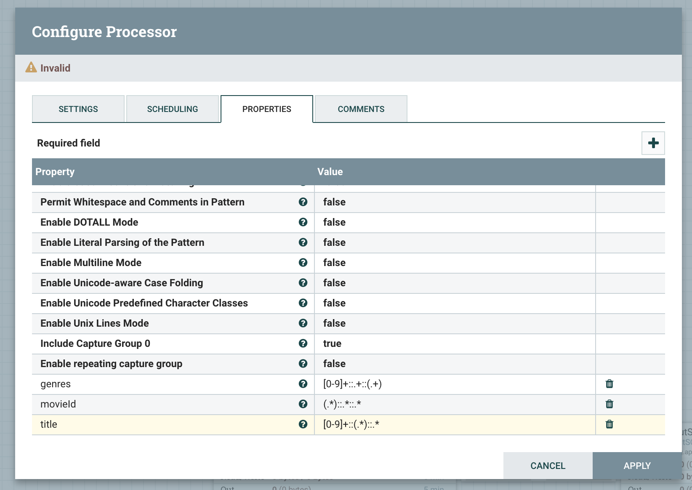

A `ReplaceText` processzor Replacement Startegy értékét állísuk Always Replace-re, az evaluation mode-ot pedig Entire Text-re.

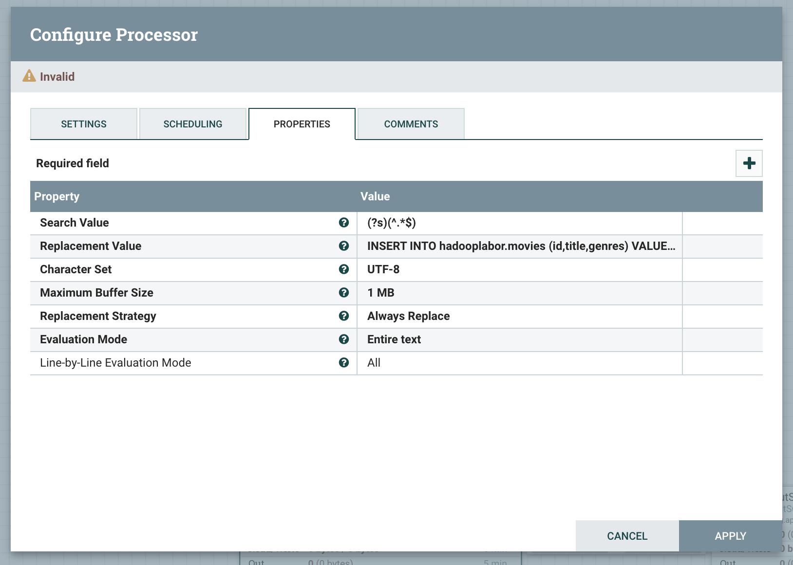

A replacement value:

```sql
INSERT INTO hadooplabor.movies (id,title,genres) VALUES (${'movieId'},'${'title'}','${'genres'}');
```

*A ${} koze zart kifejezesek a NiFi expression language elemei, jelen formaval FlowFile attributumokat tudunk behelyettesiteni.*

Az elkészült INSERT statementeket a PutSQL processzorral lefuttathatjuk és ezzel az adatrekordjaink mentésre kerülnek az adatbázisba. A PutSQL processzornak szüksége van egy NiFi servicere a DB csatlakozáshoz ennek a beállításai:

* **connection URL**: jdbc:mysql://db:3306/hadooplabor
* **Driver Class Name**: com.mysql.jdbc.Driver
* **Driver location**: /opt/nifi/mysql
* **User**: root
* **Password**: root
* **Support Fragmented Transactions**: false

A beállításhoz a processor Properties tabján adjunk hozzá új adatbázis szervice-t.

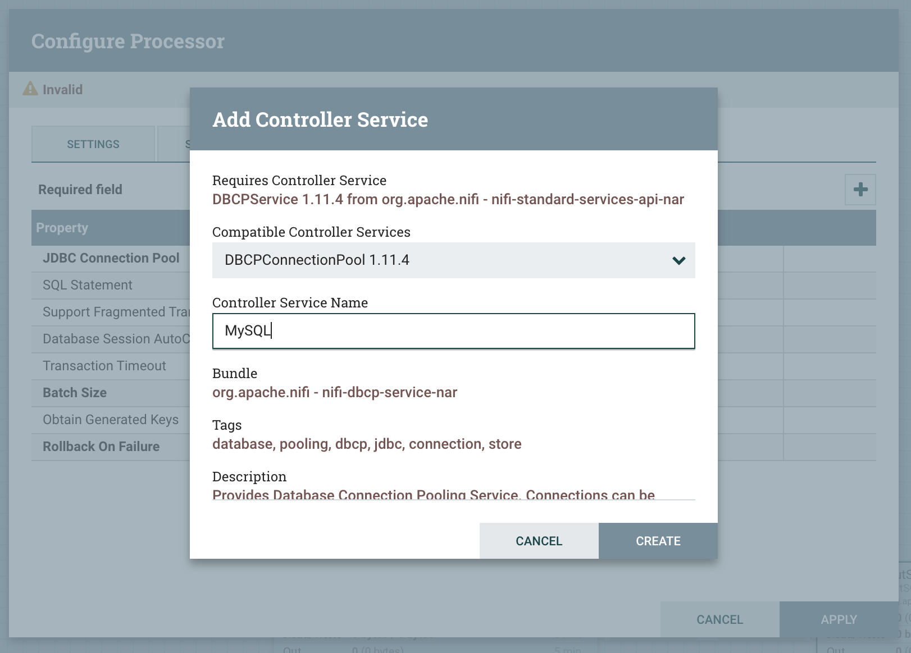

Ezt követően az új service mellett kattintsunk a jobbra mutató nyilacskára.
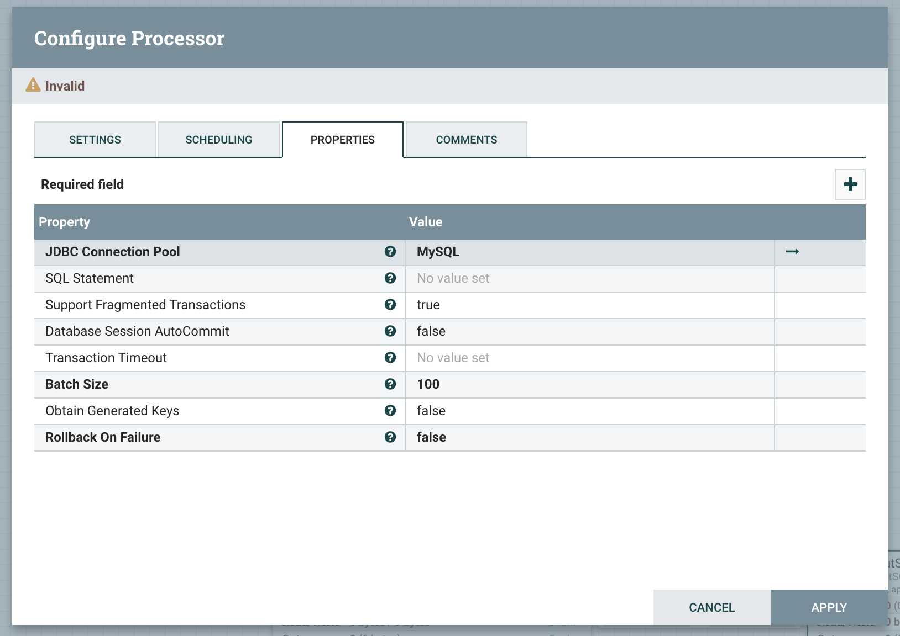

A kilistázott 1 db controller servicenél válasszuka  fogskerék ikonnal a beállításokat, majd adjuk meg a szükséges adatokat.
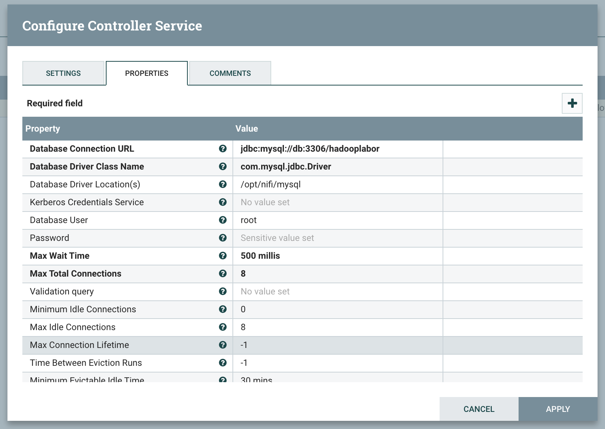

Végül a villám ikonnal aktiváljuk az adatbázis kapcsolatot.
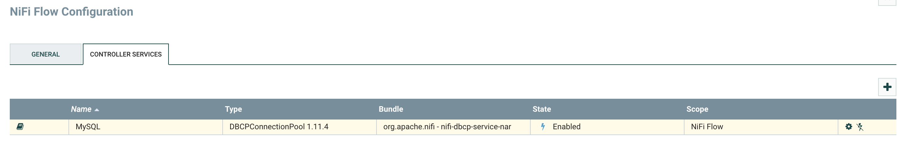

Ezt követően már cdak össze kell kössük a processorainkat, létrehozva a Connectionoket. Ezt az egérrel tudjuk megtenni. Egy processzor fölé víve az egeret megjelenik egy nyilacskás ikon, azt kell a cél processzorra húzni. A felugró ablakban ki kell választani, hogy a processzor mely kimenetét szeretnénk bekötni. Nagyon fontos, hogy a nem használt kimeneteket a processzor beállítások nézet első tabján auto terminate re kell jelölni, vagy a processzor nem fog elindulni. Ha bekötetlen és auto terminálatlan kimenetünk van azt a processzoron megjelenő sárga háromszög is jelzi.

Autoterminate kimenetek: 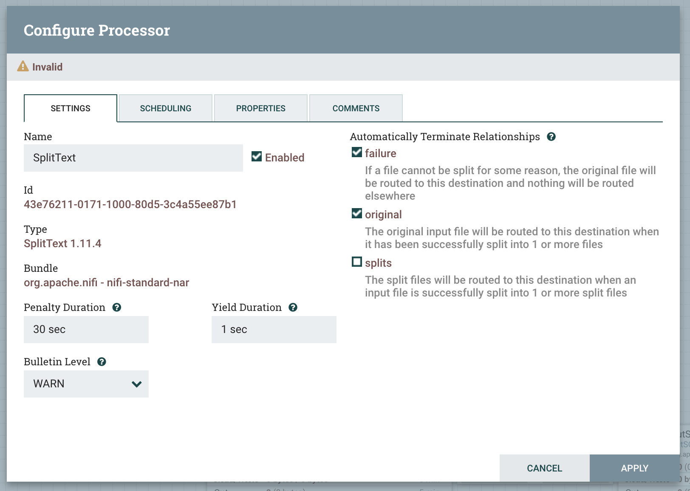

A kiválasztott kimenet neve a kapcsolaton megjelenő kis dobozon leolvasható, ez látszik az alábbi ábrán is, ez alapján kell beállítani a flowt. Az elkészült teljes flow: 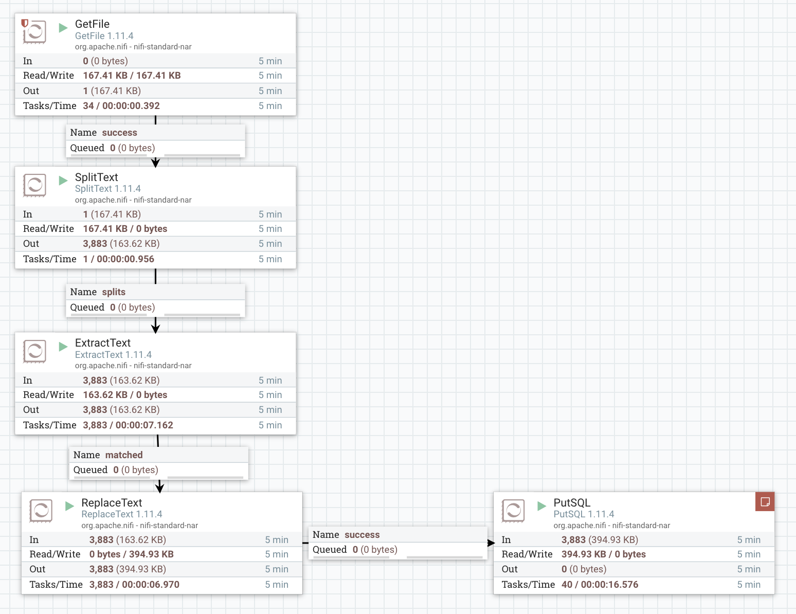

Ha mindennel megvagyunk elindíthatjuk a processzorokat. Ezt megtehetjük egyesével vagy vagy mind egyszerre. A processzoron történő jobbklikkes menüben van lehetőség a processzorok indítására és leállítására, vagy a canvas bal oldal a kijelölt processzorok egyszerre is indíthatók.

**Megjegyzés:** Az SQL insertnél lesznek hibák, mert nem escapeltük az aposztróf és idézőjel karaktereket. Ez most nem gond. ReplaceText-el egyszerűen megoldható.

A flown végigkövethetjük, hoy mi történik a fájlunkkal. Minden processzor kiírja a felületen, hogy hány rekord érkezett be és ment tovább. Ezt leglátványosabban a splittextnél láthatjuk ahol 1 FlowFile megy be és 3884 jön ki. Ha megnézzük a movies.dat fájlt annak pont ennyi sora volt, így biztosan tudhatjuk, hogy a SplitText jól működött.

*Ellenőrzés:* A jegyzőkönyvben helyezz el egy képet a létrejött flowról, illetve arról, hogy MySQL-ben megjelentek a rekordok (3426 sornak kell lennie).

#### 1.2 Feladat - Ratings dataset betöltése

A szükséges SQL adattábla:

```sql
CREATE TABLE ratings (
    userId int,
    movieId int,
    rating int,
    timestamp varchar(255),
    PRIMARY KEY (userId, movieId)
);
```

Annak érdekében, hogy átláthatóbb legyen a NiFi Flow konfigurációnk, hozzunk létre egy új Process Groupot, ahova bemásoljuk az eddigi Processorokat.
Ezen kívül hozzunk létre egy másik Process Groupot is, az aktuális feladat számára.

Itt is hasonló megoldást fogunk követni, mint az előzőekben.

> Figyelem! A Ratings adatfajlban az elvalaszto karakter nem :: hanem !

Állítsuk össze ezt a Flowt is, majd ellenőrizzük le a kapott eredményt!

*Ellenőrzés:* A jegyzőkönyvben helyezz el egy képet a létrejött flowról, illetve arról, hogy MySQL-ben megjelentek a rekordok.

### 2. Feladat - Zeppelin data exploration

[Zeppelin UI](http://localhost:16001/#/)

#### Zeppelin setup

Hogy a Zeppelin hozzáférhessen az adatbázisunkhoz, fel kell venni a MySQL drivert és az adatbázis beállításokat. Ezekkel egy új JDBC interpretert készítünk, de előbb hozzá kell adnunk egy unsecure maven repositoryt is a Zeppelinhez.

[Settings](https://zeppelin.apache.org/docs/0.8.0/interpreter/jdbc.html)

Válasszuk jobb felül az anonymus ra kattintva az Interpreter opciót.

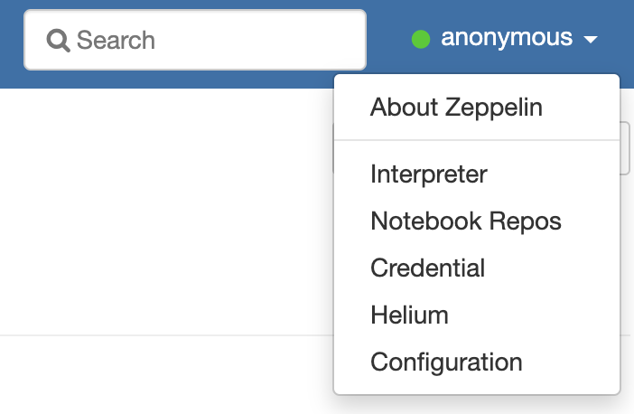

Először a maven repót adjuk hozzá, ehhez jobb felül válasszuk a repositories, majd a megjelenő lista mellett a + gombot. A formot töltsük ki a képen láthatók szerint és mentsük el. A használt mvn repository url.

```sh
http://insecure.repo1.maven.org/maven2/
```

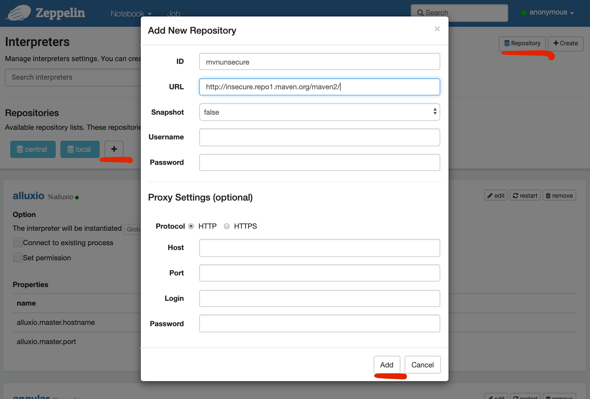

Majd jobb felül a create gombot nyomjuk meg és vegyünk fel egy új jdbc típusú interpretert az alábbi adatokkal.

* **default.driver**: com.mysql.jdbc.Driver
* **default.password**: root
* **default.user**: root
* **default.url**: jdbc:mysql://db:3306/hadooplabor
* **artifact**: mysql:mysql-connector-java:jar:5.1.45

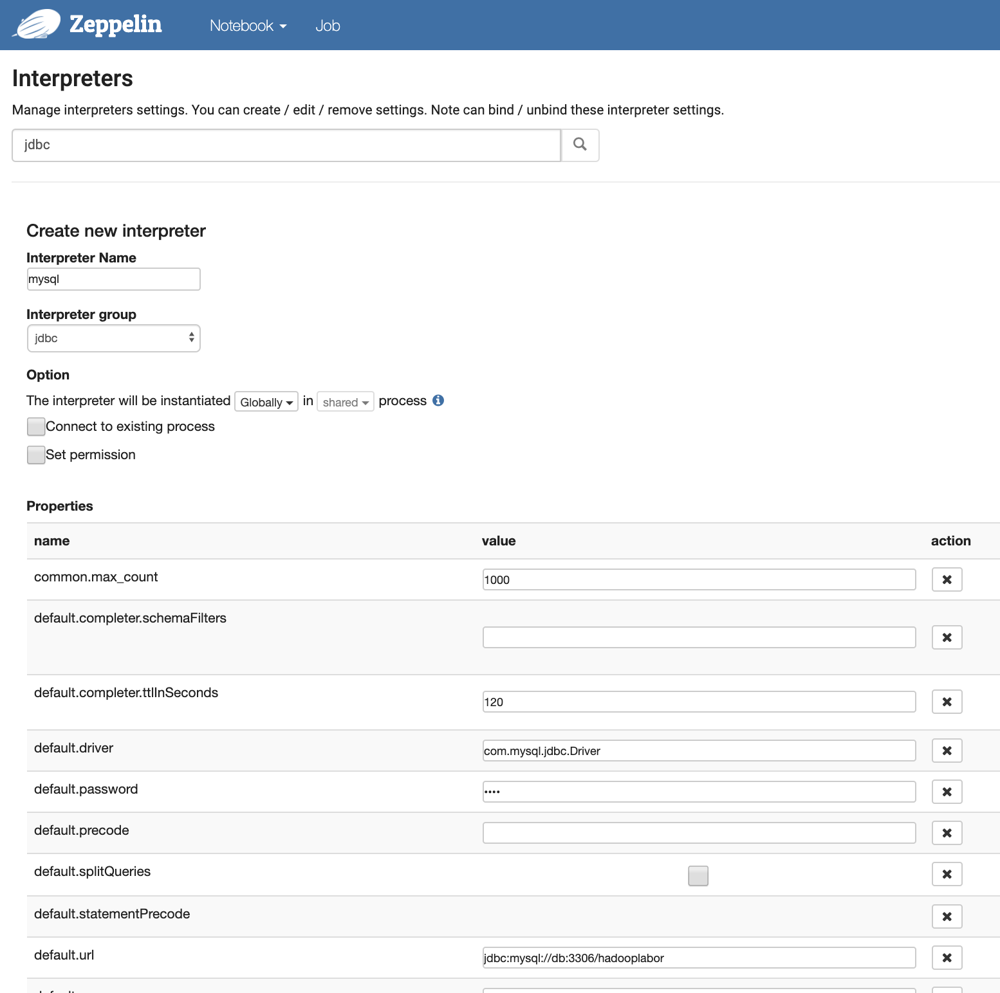
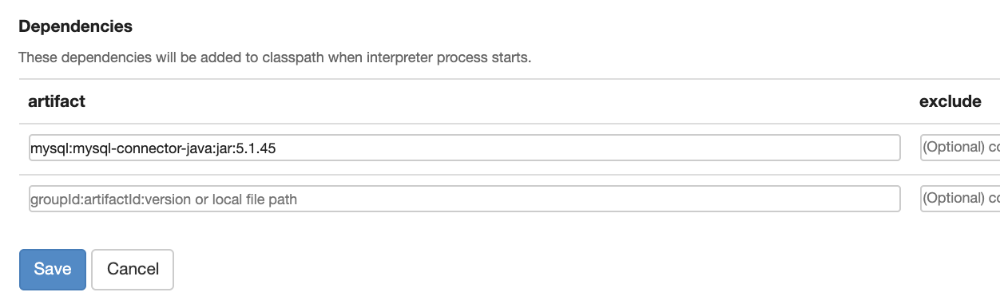

Alul a save gombbal mentsük el.

#### Néhány egyszerű lekérdezés

Hozzunk létre egy új notebookot az újonnan felvett interpreterünkkel és próbáljunk ki néhány egyszerű lekérdezést.

Akciófilmek listája:

```sql
SELECT * FROM movies WHERE genres LIKE '%Action%';
```

Értékelések eloszlása:

```sql
SELECT rating, count(*) FROM ratings GROUP BY rating;
```

Filmek száma műfajonként:

```sql
SELECT count(*) as count, genres from movies group by genres order by count desc
```

*Ellenőrzés:* A lekérdezések eredményeiről helyezz el egy képernyőképet a jegyzőkönyvben!

### 3. Feladat - Superset dashboardok

[Superset UI](http://localhost:16000/login/)

#### 3.1 Feladat - Kapcsolódás adatbázishoz

Supersetbe belépve a Sources / Databases felületen a + gombbal új adatforrást veszünk fel.

* Database: hadooplabor
* SQLAlchemy URI: mysql://root:root@db:3306/hadooplabor
* Expose in SQL Lab: true

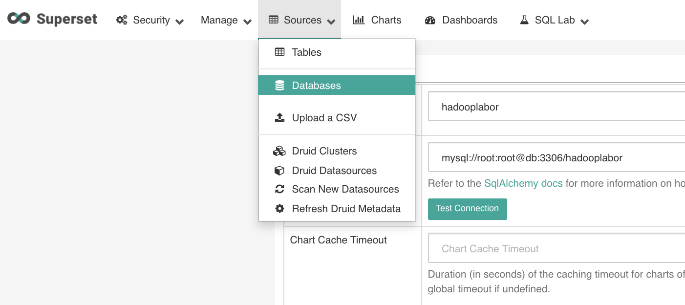

Alul a save gombbal mentsük ezt el. Ha a Superset magától nem fetchelné a táblákat akkor a 3 táblánkat is külön fel kell venni a Sources / tables müben hasonló módon.

Új grafikont a Charts menüre kattintva tudunk felvenni, ahol a varázsló végigvezet minket a lépéseken. FOntos hogy ezen a varázslós felületen csak 1 táblából tudunk dolgozni. Ha joinolni szeretnénk, akkor az SQL Lab ban kell kézzel megírjuk az SQL lekérdezést, majd annak az eredményét egy view hoz hasonlóan tudjuk bevinni a chart szerkesztőbe.

Készítsük el ugyanazokat a kimutatásokat, mint Zeppelinben!

## Önálló feladatok

### 1. Feladat - Users dataset betöltése Apache NiFi segítségével

Töltsd be a `users` adatállományt is a MySQL adatbázisba!
A betöltés során szűrd ki a 18 év alatti felhasználókat.
Az adatszerkezet leírása a repository `data/README` fájljában található. **FIGYELEM! A szeparator karekter: ,**

Tippek:

* A 18 éven aluliak kiszűréséhez jól jöhet a RouteText processzor

*Ellenőrzés:* A jegyzőkönyvben helyezz el egy képet a létrejött flowról, illetve arról, hogy MySQL-ben megjelentek a rekordok.

### 2. Feladat - Zeppelin, Superset elemzesek

Keszits tetszoleges elemzeseket az adathalmazon Zeppelin es Superset segitsegevel. Osszesen legalabb 4-et, ugyanaz elkeszitve Superetben es Zeppelinben kettonek szamit! Hasznalj kulonbozo grafikon tipusokat. Nehany tipp:

* Írj egy lekérdezést, amely kiírja a 10 legtöbbet értékelt film címét, azonosítóját és a rá érkezett értékelések számát! Vizualizald az eredmenyeket!

* Írj egy lekérdezést, amely kiírja a 10 legtöbb 1-es osztályzattal értékelt film címét, azonosítóját és a rá érkezett 1-es értékelések számát! Vizualizald az eredmenyeket!

* Írj egy lekérdezést, amely kiírja a programozók 3 kedvenc filmjének címét, azonosítóját és a rájuk érkezett 5-ös értékelések számát! (Amelyek a legtöbb 5-ös szavazatot kapták.) Vizualizald az eredményeket!

*Ellenőrzés:* A jegyzőkönyvben helyezz el képernyőképeket az elemzésekről és 1-1 mondatban írd le mit látunk a képen.
